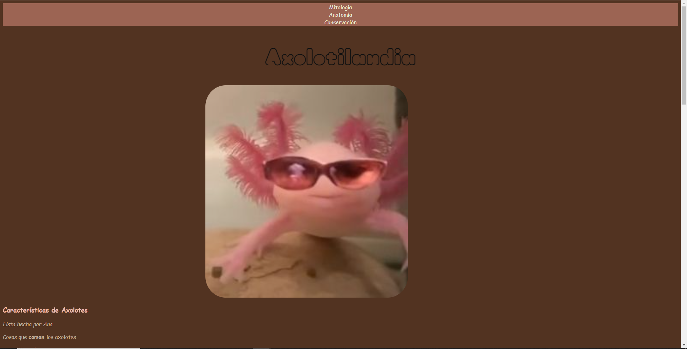

# Axolotilandia

Website created by using HTML and CSS about Axolotl. 

This is my first project (as part of the Bootcamp of Tecnolochicas Pro) as a Front-end developer and also my first contact with HTML and CSS languages. 

You can visit the website with the following link: **https://axolotilandia-tp.netlify.app/**

### Screenshot of how the page looks 

